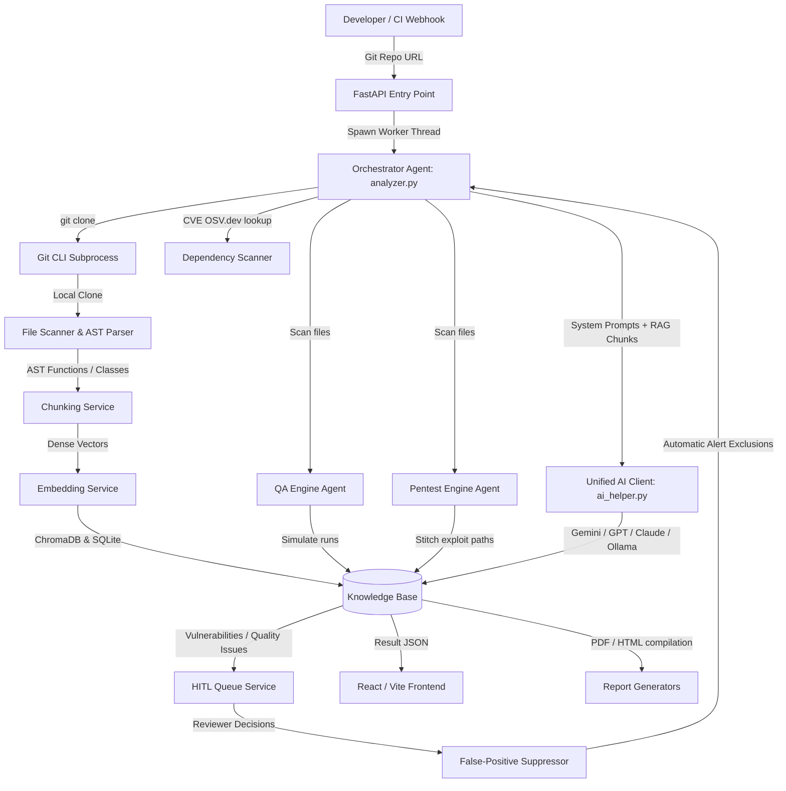
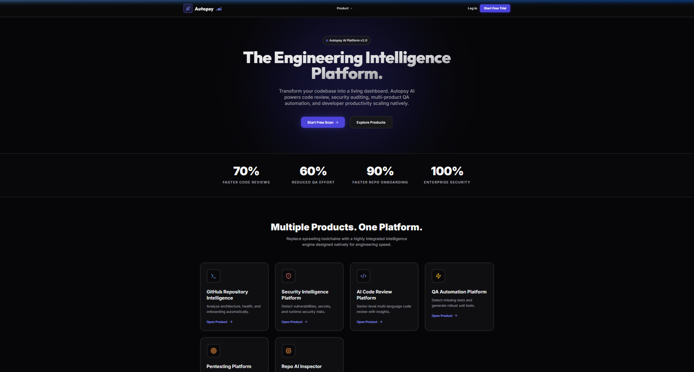
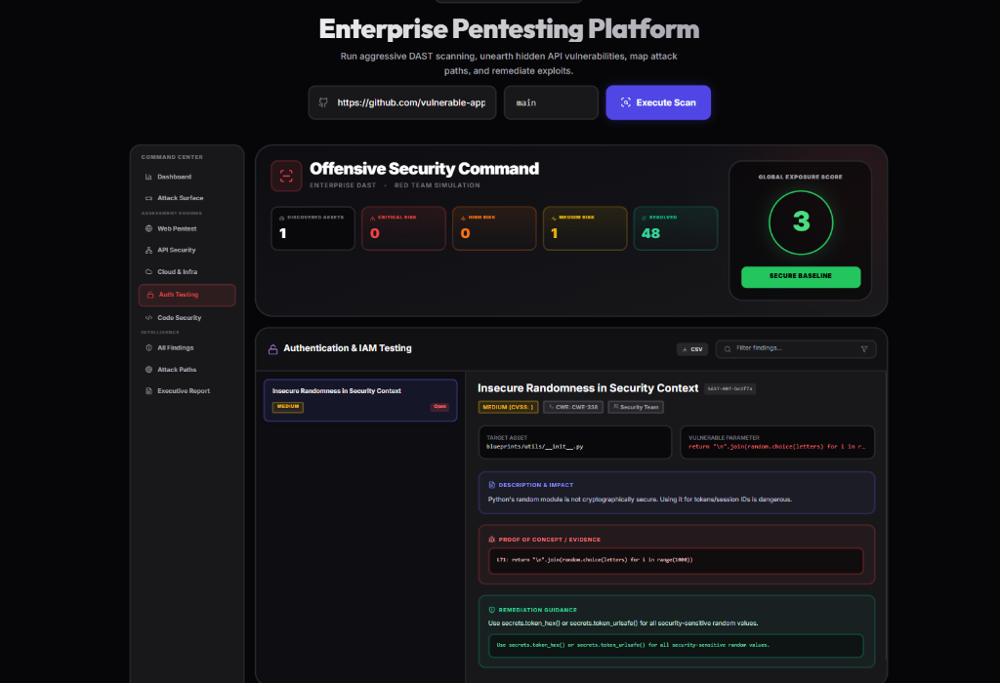
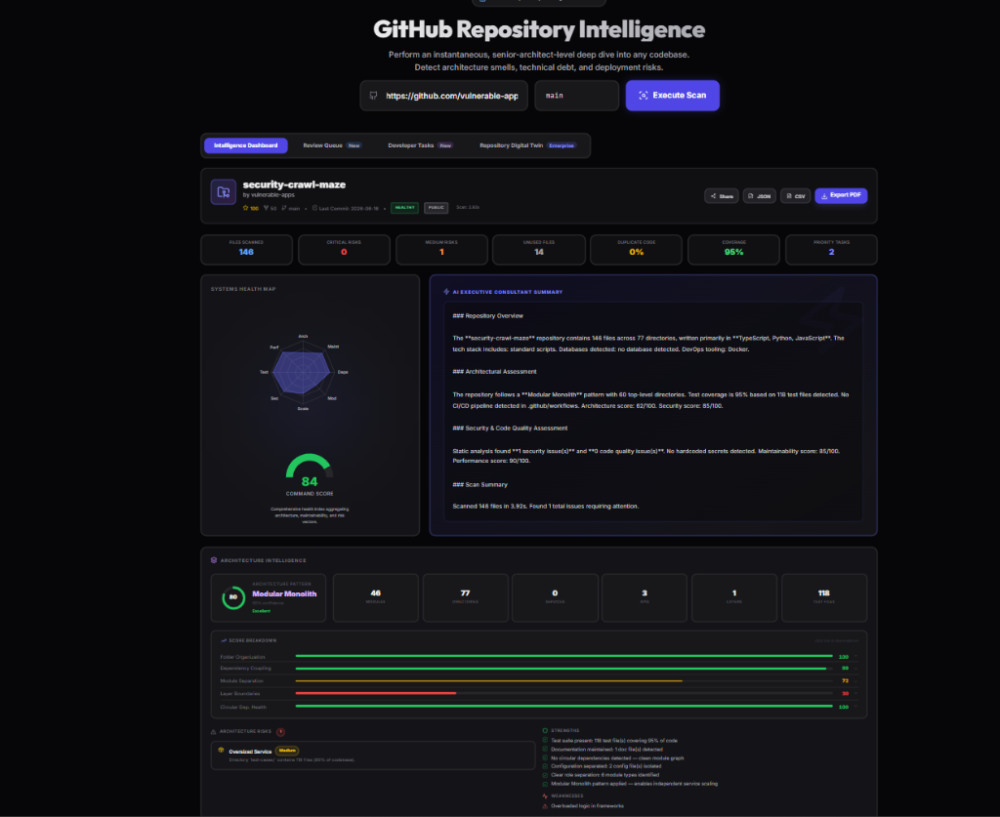
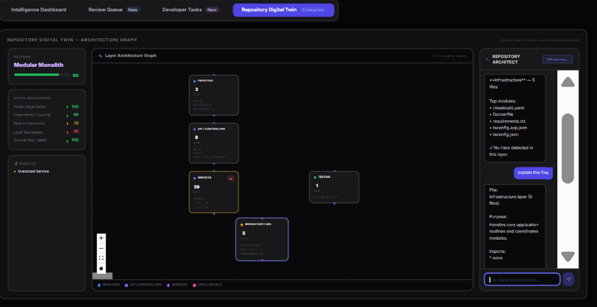

# Autopsy AI

[](https://fastapi.tiangolo.com)
[](https://react.dev)
[](#databases)
[](#local-inference)

**Automated AI-Powered DevSecOps Code Auditing, QA Gatekeeper, and Pentest Emulation Platform.**

Autopsy AI acts as an autonomous AppSec architect, QA reviewer, and penetration tester in a box. It executes shallow git checkouts of repositories, parses code structures, indexes code blocks into a vector-backed knowledge base, identifies logical bugs and vulnerabilities, simulates pipeline test execution, and routes issues to a Human-in-the-Loop governance queue.

---

## Overview

Autopsy AI is designed to automate code security reviews, QA pipelines, and offensive penetration testing simulations directly inside CI/CD lifecycles. By combining static regex-based audits with RAG-backed language models, it scans repositories, maps code topologies, and provides deep refactoring recommendations.

The platform provides a dual deployment model: it can connect to cloud-based foundation APIs (like Google Gemini, OpenAI GPT, and Anthropic Claude) or run fully local and offline using Ryzen AI NPU or Radeon GPU hardware via local inference servers (Ollama). This ensures that proprietary intellectual property and source code never have to leave the local network.

At its core, Autopsy AI implements a self-improving security database. When a human developer reviews an automatically flagged vulnerability and marks it as a false positive, the platform registers the feedback in its governance database, automatically suppressing the matching finding in all future repository scans.

---

## Problem Statement

In modern software development lifecycles, automated code reviews and security gates suffer from critical bottlenecks:
1. **AppSec Knowledge Gaps**: Standard linters and static tools are incapable of tracing logical business vulnerability flows (e.g., Broken Object Level Authorization, state mutation bugs, or auth bypasses).
2. **QA Pipeline Flakiness**: High test suite instability, low test coverage, and a lack of contextual insight into E2E failures block release velocity.
3. **Expensive DAST Audits**: Full dynamic penetration testing is expensive, slow, and rarely integrated into early dev/staging branches.
4. **Alert Fatigue**: Automated scanner alerts frequently exhaust developer productivity due to high false-positive rates and the lack of a centralized feedback loop to suppress duplicate alerts.

---

## Key Features

### 🔍 Repository Intelligence
* **Tech Stack Detection**: Automatically parses dependency manifests (`package.json`, `requirements.txt`, `pyproject.toml`, `pom.xml`, etc.) to map active languages, frontend/backend frameworks, and database connectors.
* **Architecture Graph**: Builds a node-edge structural graph representing file import connections, React hooks, and API endpoints.

### 🛡️ Security Analysis (SAST)
* **OWASP Vulnerability Scan**: Executes static regex rules evaluating codebase vulnerability indicators (e.g. SQL injection f-strings, dangerous commands like `eval`/`exec`, weak cryptos, and path traversal).
* **Credential Scanner**: Inspects code files for hardcoded secrets, password variables, Stripe keys, and API tokens.

### 🤖 AI Code Review
* **Maintainability & Smell Analyzer**: Scores file structures, flags oversized classes ("God Objects"), evaluates cyclomatic complexity, and supplies copyable refactored code blocks.

### 🧪 QA Automation Gate
* **Coverage Gap Analysis**: Maps source files to existing test files (`pytest`, `Jest`, `JUnit`, etc.) to identify untested modules.
* **Release Confidence Gating**: Deducts points from a baseline score of `100` for low coverage (<40%), flaky test components, or historical failures to output a final `PASS` or `BLOCK` decision.

### 🕸️ Pentesting Emulation
* **Exploit Path Construction**: Identifies routes, matches parameters, and builds interactive visual chains showing how an attacker could move from reconnaissance to payload execution.

### 👥 Human-in-the-Loop (HITL) Queue
* **SLA & Queue Management**: Tracks pending reviews, assigns owner teams (Frontend, Backend, Security, QA, etc.), and allows reviewers to approve, reject, or mark alerts as false positives.
* **Feedback Loop Suppression**: Remembers rejected items to suppress identical findings on subsequent repository scans.

### 📊 Reports & Exports
* **PDF & HTML Compilers**: Generates ReportLab executive PDFs and interactive single-page HTML audit reports featuring Canvas-based radar charts.

---

## Architecture

The diagram below details how Autopsy AI coordinates ingestion, database indexing, and multi-agent AI execution:



---

## How It Works

1. **Repository Ingestion**: The developer inputs a git repository URL and branch name. The FastAPI backend spawns an asynchronous worker thread that runs a shallow git clone (`git clone --depth 1`) using a subprocess.
2. **Topology & Stack Scanning**: The scanner walks the directory structure, excluding noise directories (e.g. `node_modules`, `venv`, `.git`). It parses manifest files to identify languages and frameworks.
3. **AST-Based Chunking & Indexing**: The codebase is segmented into logical blocks:
   * **Python (`.py`)**: Uses Python's native `ast` module to segment code along function and class boundaries.
   * **JavaScript/TypeScript (`.js`, `.ts`, `.jsx`, `.tsx`)**: Evaluates keywords (`class`, `const`, `function`) to partition components and scripts.
   * **Configs & Docs**: Parsed as single root configuration files.
4. **Knowledge Base Generation**: Text segments are stored in SQLite (`intelligence_v2.db`) and indexed into ChromaDB.
5. **AI Auditing & RAG Retrieval**: When security, QA, or architecture analyses are initiated, a hybrid search retrieves relevant codebase chunks. These chunks are injected into structured system prompts requesting zero-shot JSON payloads from the configured LLM API.
6. **Enrichment & Reporting**: Detected vulnerabilities are classified by severity, mapped to owner teams, and compiled into download-ready ReportLab PDFs, HTML reports, and interactive React dashboards.

---

## Tech Stack

### Frontend
* **Core Framework**: React (v18+) & Vite
* **Routing**: React Router DOM
* **Styling & Icons**: Tailwind CSS & Lucide React
* **Animations**: Framer Motion
* **Visualizations**: React Flow (for DAG exploit paths) & Recharts

### Backend
* **Core Framework**: FastAPI & Uvicorn ASGI Server
* **Networking**: HTTPX (asynchronous client)
* **API integrations**: OSV.dev (vulnerability data), npm & PyPI registries (version checks)
* **PDF Compiler**: ReportLab

### AI Stack
* **Cloud API Integrations**: Google Gemini API, OpenAI API, Anthropic Claude API, OpenRouter
* **Local Inference Node**: Ollama (defaulting to `qwen2.5-coder:7b` model over local ports)

### Databases
* **Job States**: SQLite (`autopsy_jobs.db` via SQLAlchemy)
* **Knowledge Store**: Dual-engine setup using SQLite (`intelligence_v2.db`) locally, featuring configuration hooks for PostgreSQL with `pgvector` (`Vector(768)` type columns).
* **Vector Store**: ChromaDB (locally persisted)

---

## Screenshots

Below are the interface panel layouts:

### Dashboard

*Provides an overview of repository health, scanned stack modules, circular dependencies, and general maintainability grades.*

### Security Analysis

*Displays OWASP vulnerability classifications, hardcoded credential leaks, and CVE details mapped to specific file ranges.*

### Architecture View

*Interactive import relationship and dependency mapping visualization.*

### AI Copilot

*RAG-powered conversational terminal providing contextual answers from parsed file chunks.*

---

## Installation

### Clone Repository
```bash
git clone https://github.com/ChetanDongre2004/Autopsy-ai.git
cd Autopsy-ai
```

### Backend Setup
1. Navigate to the backend directory and set up a Python virtual environment:
   ```bash
   cd backend
   python -m venv venv
   ```
2. Activate the virtual environment:
   * **Windows (cmd/powershell)**:
     ```cmd
     venv\Scripts\activate
     ```
   * **Mac/Linux**:
     ```bash
     source venv/bin/activate
     ```
3. Install dependencies:
   ```bash
   pip install -r requirements.txt
   ```

### Environment Variables
Copy the template configuration file:
```bash
cp .env.example .env
```
Open `.env` and configure at least one AI provider:
```env
# Cloud AI Provider Keys (Optional)
GEMINI_API_KEY=your_gemini_key_here
GEMINI_MODEL=gemini-2.0-flash

# OR
OPENAI_API_KEY=your_openai_key_here
OPENAI_MODEL=gpt-4o

# OR
ANTHROPIC_API_KEY=your_claude_key_here
CLAUDE_MODEL=claude-3-haiku-20240307

# For Local On-Device Mode:
AI_PROVIDER=local_ollama
LOCAL_LLM_URL=http://127.0.0.1:11434
LOCAL_LLM_MODEL=qwen2.5-coder:7b

# GitHub Integration (Optional)
GITHUB_TOKEN=your_personal_access_token
```

### Database Setup
The SQLite databases are automatically initialized when the backend bootstraps. No manual migrations are required for local executions.

### Frontend Setup
1. Open a new terminal and navigate to the frontend directory:
   ```bash
   cd frontend
   npm install
   ```
2. Run the Vite development server:
   ```bash
   npm run dev
   ```

---

## Usage

### Run Application
You can run the startup scripts or run services individually:
* **Windows (Single CLI Start)**:
  ```cmd
  cd Autopsy-ai
  start_windows.bat
  ```
* **Mac/Linux**:
  ```bash
  cd Autopsy-ai
  ./start_mac_linux.sh
  ```

### API Examples

#### Start a Repository Scan
```bash
curl -X POST http://localhost:8000/api/v1/scan/start \
  -H "Content-Type: application/json" \
  -d '{"url": "https://github.com/owner/repo", "branch": "main"}'
```

#### Poll Scanning Status
```bash
curl -X GET http://localhost:8000/api/v1/scan/status/{job_id}
```

#### Fetch Scan Results
```bash
curl -X GET http://localhost:8000/api/v1/scan/result/{job_id}
```

#### Submit Governance Decision
```bash
curl -X POST http://localhost:8000/api/v1/github/governance/review \
  -H "Content-Type: application/json" \
  -d '{"task_id": "job_id_or_finding_id", "decision": "REJECTED", "notes": "Confirmed mock key in tests."}'
```

---

## AI Architecture

* **Multi-Provider Client**: Implemented in `backend/ai_helper.py`, dynamically detecting keys sequentially: Ollama $\rightarrow$ OpenRouter $\rightarrow$ Gemini $\rightarrow$ OpenAI $\rightarrow$ Anthropic.
* **AST Code Chunking**: Preserves structural units (classes/functions) for code files, preventing the truncation of syntax blocks.
* **Hybrid Search Retrieval**: Matches target keywords (with an exact path weight multiplier of `+3.0`) and calculates vector distances. Results are joined into a context segment injected into the LLM system prompt.
* **On-Device Optimization (AMD AI Hub)**: Features hardware optimization mappings evaluating local Ryzen AI NPU (ONNX / XDNA2) and Radeon GPU (PyTorch ROCm 6.1) compatibility, computing simulated VRAM allocations and token throughputs:
  * **FP16**: Requires **~14.9 GB VRAM** (for 7B models like Qwen 2.5 Coder).
  * **INT8**: Requires **~8.2 GB VRAM**.
  * **INT4**: Requires **~4.7 GB VRAM** (compatible with edge NPUs).

---

## Security Features

* **SAST (Static Application Security Testing)**: Traverses code files matching regex expressions targeting SQL injections, system command exposure, and weak cipher functions.
* **Credential Scans**: Runs automated regex reviews for API tokens, certificates, and hardcoded connection strings.
* **Dependency Analysis**: Directly queries the OSV.dev database with dependency manifests to identify known package CVEs.
* **Governance suppression**: Dynamically checks the `github_false_positive_memory` table to filter out previously rejected warnings.

---

## Project Structure

```text
Autopsy-ai/
│
├── backend/                       # FastAPI Backend
│   ├── core/                      # RAG and Analytics Core
│   │   ├── chunking_service.py    # AST and markdown chunk separators
│   │   ├── embedding_service.py   # Code embedding interface
│   │   ├── fingerprint_engine.py  # Repository hashing utilities
│   │   ├── historical_memory.py   # Historical context generator
│   │   ├── hybrid_search.py       # Semantic and keyword search
│   │   ├── pentest_engine.py      # DAST simulation and exploit mapper
│   │   ├── qa_engine.py           # QA test suite and flake simulator
│   │   ├── repository_graph.py    # Node-edge dependency graphs
│   │   ├── rerank_service.py      # Reranking logic
│   │   └── retrieval_service.py   # Vector retrieval engines
│   │
│   ├── routes/                    # Modular API Routers (legacy/standalone)
│   │   ├── bug_hunter.py          # Credential scans & OWASP audits
│   │   ├── reviewer.py            # Code quality and smell analyzer
│   │   ├── tester.py              # Pytest/Jest unit test generators
│   │   ├── dependency_scanner.py  # OSV.dev CVE checks
│   │   ├── package_checker.py     # Registry version checkers
│   │   ├── branch_comparator.py   # Git branch diff comparison
│   │   └── report_export.py       # Standalone HTML report compilers
│   │
│   ├── services/                  # Business Logic and Orchestrators
│   │   ├── analyzer.py            # Master scan orchestrator (RepoIntelligence)
│   │   ├── kb_service.py          # SQLAlchemy models and SQLite migrations
│   │   ├── smart_findings_engine.py # Vulnerability prioritization engine
│   │   ├── github_hitl_service.py # Human review queue governance
│   │   └── pdf_generator.py       # ReportLab PDF builders
│   │
│   ├── utils/                     # Formatting Helpers
│   │   ├── constants.py           # File exclusion lists
│   │   ├── git_ops.py             # Git cloning utilities
│   │   └── parsers.py             # JSON cleaners and package parsers
│   │
│   ├── ai_helper.py               # Gemini / OpenAI / Claude API clients
│   └── main.py                    # Main API entry point and routes
│
├── frontend/                      # React Frontend
│   ├── src/
│   │   ├── components/            # UI Components
│   │   │   ├── RepoDashboard.jsx  # Maintainability & metrics views
│   │   │   ├── CodeSecurityDashboard.jsx # Vulnerability and secret lists
│   │   │   ├── QaAutomationDashboard.jsx # Test run and flake logs
│   │   │   ├── PentestDashboard.jsx  # Exploit graphs and recon views
│   │   │   └── AmdAiHub.jsx          # GPU telemetry and NPU observer
│   │   │
│   │   ├── App.jsx                # UI router and status polling loop
│   │   ├── index.css              # Custom Tailwind configurations
│   │   └── main.jsx               # React DOM bootstrapper
│   └── package.json               # Node dependencies
│
└── start_windows.bat              # Service startup script
```

---

## Performance

Performance metrics for scan and inference latencies have not yet been benchmarked outside the telemetry estimates computed dynamically inside the `ModelDiscoveryEngine` and simulated in the AMD AI Hub interface:
* **Cloud API Latency**: Bounded by network/region queues (`~1.5s - 4.5s` per query).
* **Local Inference (Ryzen AI NPU / ONNX)**: Simulated at `~40 - 62 tok/s` (Latency: `~1.5s - 3s` per response).
* **Local Inference (Radeon GPU / ROCm)**: Simulated at `~80 - 150+ tok/s` (Latency: `< 1s` response times).

---

## Roadmap

### Completed
* **Unified API Client**: Supports Gemini, OpenAI, Claude, and Local Ollama ports.
* **Static Vuln & Secret Scanners**: Implemented and active in `pentest_engine.py` and `analyzer.py`.
* **AST Chunking & Local Storage**: Python AST chunkers and SQLite databases active.
* **HITL Rejection Queue**: False-positive suppression memory tables completed.
* **Vite + React UI**: Main dashboards and AMD AI Hub telemetry panel operational.

### In Progress
* **True Vector Embeddings**: Transitioning local fallback (`0.01` arrays) to SentenceTransformers or OpenAI embedding APIs.
* **True Reranker Client**: Replacing raw list slicing with a Cohere cross-encoder.
* **PostgreSQL pgvector Migration**: Testing pgvector query performance under large concurrent scans.

### Planned
* **Interactive Exploit Execution**: Allowing sandbox execution of the emulated exploit paths.
* **Direct Git Commit Fixes**: Enabling developers to commit refactored solutions back to GitHub branches directly from the dashboard.

---

## Contributing

1. Fork the repository.
2. Create a feature branch: `git checkout -b feature/your-feature-name`
3. Commit changes: `git commit -m "Add some feature"`
4. Push to branch: `git push origin feature/your-feature-name`
5. Open a Pull Request.

---

## License

This project is licensed under the MIT License. (Refer to the repository file structure; no separate LICENSE file is currently present).

---

## Acknowledgements

* **FastAPI** & **Uvicorn** for the async backend framework.
* **OSV.dev** for the open source package vulnerability database.
* **React Flow** for the interactive DAG charts.
* **Ollama** & the **Qwen Team** for local developer models.
* **AMD** for the ROCm and Ryzen AI development toolkits.
