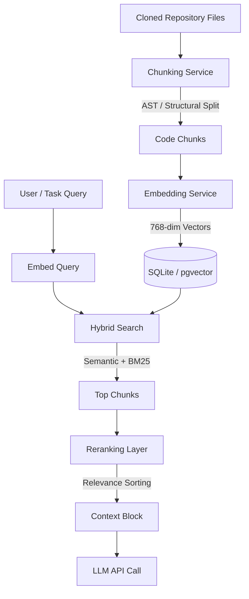
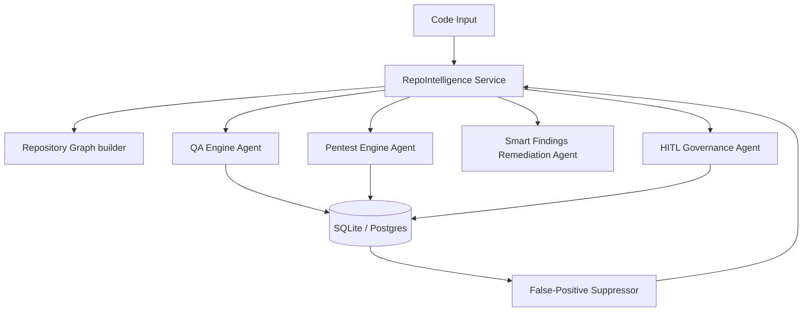

# Autopsy AI: Project Walkthrough & Implementation Guide

This guide provides a comprehensive Q&A manual detailing the design patterns, code execution flow, RAG pipeline, and development lifecycle of **Autopsy AI**.

---

## Part 1: Executive Q&A & High-Level Design

### Q1: What is Autopsy AI and what problem does it solve?
**Answer:**
Autopsy AI is an automated AI-powered DevSecOps code auditing, QA automation, and penetration testing emulation platform. It acts as a **"Senior Developer and AppSec Architect in a Box."** 

In modern software development lifecycles (SDLCs):
1. **AppSec Knowledge Gaps** exist because human code reviews are slow, and standard static analysis tools (like typical linters) cannot trace logical business vulnerability flows (e.g., Broken Object Level Authorization, state mutations, or business logic bypasses).
2. **QA Pipelines suffer from flakiness**, low test coverage, and a lack of contextual insight into why UI/E2E test runs fail.
3. **Dynamic Pentesting (DAST)** is expensive and rarely integrated directly into staging/development branches.
4. **False Positive Fatigue** degrades developer productivity when automated tools generate security alerts that are ignored or suppressed manually on each run.

Autopsy AI addresses these issues by checking out codebases, vectorizing them, mapping relationships into a dependency graph, analyzing structural logic using specialized LLM agents, simulating QA and DAST runs, and managing alerts via a Human-in-the-Loop (HITL) queue.

---

### Q2: What is the full technology stack of the project?
**Answer:**
The project uses a modern decoupled architecture:

*   **Frontend (React SPA)**:
    *   **Core**: React (v18+) with Vite.
    *   **Routing**: React Router DOM (managing views: Landing Page, Repository Dashboard, Security Dashboard, QA Dashboard, Pentest Dashboard, and HITL Queue).
    *   **Styling**: Tailwind CSS for dark-mode interfaces.
    *   **Animations**: Framer Motion for micro-interactions.
    *   **Visualizations**: Canvas-based interactive radar charts and node-edge dependency graphs.
*   **Backend (FastAPI)**:
    *   **Core**: FastAPI with Uvicorn (ASGI).
    *   **Networking**: HTTPX (`httpx.AsyncClient`) for async external requests (e.g., OSV.dev registry calls).
    *   **Task Scheduling**: SQLite job tables combined with FastAPI `BackgroundTasks` to support non-blocking scanning.
    *   **Databases**:
        *   **State & Schedules**: SQLite (`autopsy_jobs.db`).
        *   **Knowledge Base**: SQLite (`intelligence_v2.db`) for local configurations, with built-in pgvector configuration hooks for production PostgreSQL deployments.
    *   **PDF Exports**: ReportLab for generating executive security reports.
*   **AI Providers**:
    *   A unified interface (`ai_helper.py`) wrapper that checks local environment keys sequentially:
        1. **Google Gemini API** (utilizing `gemini-1.5-flash` with system instructions).
        2. **OpenAI API** (utilizing `gpt-4o`).
        3. **Anthropic Claude API** (utilizing `claude-3-haiku-20240307`).

---

### Q3: How do we run and bootstrap the project locally?
**Answer:**
The project includes startup scripts for Windows and Linux/MacOS:
*   **Windows**: Run `start_windows.bat`. This initializes the backend virtual environment, installs dependencies from `requirements.txt`, creates the SQLite job database, starts the Uvicorn backend server on port `8000`, installs frontend Node dependencies, and launches the Vite frontend development server on port `5173`.
*   **Mac/Linux**: Run `start_mac_linux.sh` which executes the equivalent setup steps.

---

## Part 2: Deep Dive into the RAG Pipeline

### Q4: How is the Retrieval-Augmented Generation (RAG) pipeline structured?
**Answer:**
The RAG pipeline is designed to extract, index, and retrieve specific context from codebases and supply it to the LLM. 



#### Step-by-Step RAG Pipeline Execution Flow:

1.  **Ingestion & Git Ops (`git_ops.py`)**:
    The scan process begins when a user submits a repository URL. The backend executes a shallow clone (`git clone --depth 1`) using a subprocess. The files are traversed, ignoring build outputs, virtual environments, and node packages (e.g., `node_modules`, `.git`, `venv`).
2.  **Language-Specific AST Chunking (`chunking_service.py`)**:
    Rather than using a generic token splitter, Autopsy AI segments code based on logical blocks:
    *   **Python (`.py`)**: Uses Python's native `ast` parser. It walks the abstract syntax tree and extracts entire function segments (`FunctionDef` / `AsyncFunctionDef`) and classes (`ClassDef`) via `ast.get_source_segment()`.
    *   **JavaScript/TypeScript (`.js`, `.ts`, `.jsx`, `.tsx`)**: Evaluates structural keywords (`class`, `const`, `function`) to split components and scripts.
    *   **Markdown (`.md`, `.txt`)**: Segments documents based on markdown headers (`\n## `).
    *   **Configs (`.json`, `.yaml`, `.toml`, `Dockerfile`)**: Parsed as single root configuration files.
3.  **Vector Embedding Generation (`embedding_service.py`)**:
    Converts text chunks into dense multi-dimensional vectors (768 dimensions). In local environments, the mock implementation maps these to `0.01` arrays. In production, this interfaces with OpenAI's `text-embedding-3-large` or SentenceTransformers.
4.  **Persistence Layer (`kb_service.py`)**:
    The chunks are stored in `repo_chunks`. If a PostgreSQL database is available, the embeddings are stored in a table (`repo_embeddings`) using the `Vector(768)` type from `pgvector`. On local setups, the database falls back to a standard SQLite database.
5.  **Task-Aware Contextual Retrieval (`retrieval_service.py` & `hybrid_search.py`)**:
    Retrieval adjusts based on the current task:
    *   *Architecture analysis* filters for chunks tagged with `['architecture', 'module']`.
    *   *Security analysis* filters for chunks tagged with `['auth', 'security', 'database']`.
    *   *QA posture* filters for chunks tagged with `['test', 'coverage']`.
    
    A **Hybrid Search** combines keyword matching (BM25 logic) with semantic vector lookups:
    *   File path matches receive a high weight multiplier (`+3.0`).
    *   Exact token occurrences in code body content score `+1.0` plus `+0.1` per extra keyword hit.
6.  **Re-ranking (`rerank_service.py`)**:
    The raw results are sorted by relevance. The default setup passes the top-N results. In production, it can integrate a Cohere cross-encoder client to sort based on exact logical similarity to the query.
7.  **Context Assembly & LLM Prompting (`ai_helper.py`)**:
    The retrieved code chunks are concatenated with file markers:
    ```text
    File: auth/middleware.py
    Content:
    def verify_jwt(token):
        ...
    ```
    This block is injected into the LLM system prompt along with zero-shot instruction constraints to enforce JSON schema responses.

---

## Part 3: Autonomous Service Agents & Core Engines



### Q5: What are the main agents/engines in the backend?
**Answer:**
Autopsy AI coordinates the audit through 5 autonomous services:

1.  **The Orchestrator Agent (`RepoIntelligence` in `analyzer.py`)**:
    The main coordinator that runs the scan pipeline, extracts file structures, computes fingerprints, calls AST chunking, generates embeddings, registers graph structures, runs QA/Pentest simulators, and formats the unified dashboard response.
2.  **The QA Automation Agent (`QAEngine` in `qa_engine.py`)**:
    Acts as an SDET. It crawls the codebase, identifies endpoints and UI routes, mocks unit/E2E test pipelines, logs test run failures, identifies flaky test targets, and computes the Release Confidence Score.
3.  **The Pentesting Agent (`PentestEngine` in `pentest_engine.py`)**:
    Acts as an offensive security tester. It maps internal APIs and ports, runs regex scans for exposed keys, parses URL paths, constructs attack paths, and formats step-by-step exploit proof-of-concepts.
4.  **The Remediation Agent (`SmartFindingsEngine` in `smart_findings_engine.py`)**:
    Prioritizes findings, maps CVEs to standard fixes, classifies them by severity, and links them to owner teams (Frontend, Backend, DevOps, Data, etc.) depending on file paths and code snippets.
5.  **The Governance Agent (`GitHubHITLService` in `github_hitl_service.py`)**:
    Manages the human validation dashboard queue, tracks SLA countdowns, and logs reviewer approvals or false-positive markings.

---

### Q6: How does the QA Release Confidence Score calculation work?
**Answer:**
Defined in [qa_engine.py](file:///c:/Users/91902/Downloads/project/Autopsy-ai/backend/core/qa_engine.py#L98-L113), the release gate score starts at `100` and subtracts penalty points based on pipeline criteria:
*   **Low Code Coverage**: If coverage is under `50%`, it deducts **15 points** and raises a coverage block reason.
*   **P0 Failures**: If any P0 (priority-0) automated test fails (e.g. login auth flows or critical payments), it deducts **30 points** and blocks the release.
*   **Test Suite Instability (Flakiness)**: If flaky tests exceed `5%` of the total test suite, it deducts **10 points**.
*   **Missing Core Elements**: Deducts **10 points** if no API routes or UI components are detected.
*   **Failed runs count**: Deducts **2 points** per failed test run.

If the final score is **>= 80**, the release decision is **SAFE TO RELEASE**. Between **60 and 79**, it flags **REVIEW REQUIRED**, and below **60**, it outputs **BLOCK RELEASE**.

---

### Q7: How does the Pentest Engine construct exploit chains?
**Answer:**
Implemented in [pentest_engine.py](file:///c:/Users/91902/Downloads/project/Autopsy-ai/backend/core/pentest_engine.py), the engine:
1.  **Reconnaissance**: Scans directory structures for Docker, K8s, or package files to map deployment hosts. Inspects backend code configuration to determine active database ports.
2.  **Vulnerability Retrieval**: Queries the database using the RAG pipeline for patterns containing security flaws.
3.  **Payload Injection Mapping**: If auth-bypass patterns are discovered, it records a CVSS score and maps parameter targets (e.g. `user_id`).
4.  **Chaining Attack Vectors**: Links individual findings into sequential attack graphs, which are displayed in the frontend dashboard.
    *   *Example Exploit Graph*:
        `Discover API endpoints` $\rightarrow$ `Extract JWT session` $\rightarrow$ `Modify request parameters (BOLA)` $\rightarrow$ `Bypass authentication` $\rightarrow$ `Exfiltrate tenant PII data`.

---

### Q8: How does the Human-in-the-Loop (HITL) False-Positive suppression loop work?
**Answer:**
When Autopsy AI identifies a security issue or code smell, it routes the finding to the `github_findings` table with a state of `PENDING_REVIEW` and sets a target SLA deadline based on severity (e.g. 24 hours for Critical).

A human reviewer accesses this task on the governance board and submits a decision:
*   **If Approved**: The finding is retained, and remediation tasks are created.
*   **If Marked as False Positive**: The Governance Agent saves the item to the `github_false_positive_memory` table (storing the repository ID, finding type, file path, and rejection reason).
*   **On Subsequent Scans**: The Orchestrator queries `github_false_positive_memory`. If a newly detected finding matches a previously suppressed file path and finding type, it is automatically excluded. This helps suppress repeated false positives over time.

---

## Part 4: Code walkthrough of core modules

### Q9: What are the key source modules and their roles?
**Answer:**

| Module Path | Core Role & Responsibilities |
| :--- | :--- |
| **[main.py](file:///c:/Users/91902/Downloads/project/Autopsy-ai/backend/main.py)** | Entry point. Sets up the FastAPI app, manages background threads for scans, handles file/ZIP uploads, and exposes `/api/v1/scan/...` and `/api/v1/github/governance/...` endpoints. |
| **[analyzer.py](file:///c:/Users/91902/Downloads/project/Autopsy-ai/backend/services/analyzer.py)** | Coordinates scanning steps: cloning, stack detection, AST parsing, indexing chunks, querying QA/Pentest engines, and saving results. |
| **[kb_service.py](file:///c:/Users/91902/Downloads/project/Autopsy-ai/backend/services/kb_service.py)** | Declares SQLAlchemy model schemas (`Repository`, `RepoScan`, `RepoChunk`, `RepoEmbedding`, `RepoFinding`, etc.) and handles migration logic. |
| **[chunking_service.py](file:///c:/Users/91902/Downloads/project/Autopsy-ai/backend/core/chunking_service.py)** | Segments source code using abstract syntax tree modules (for Python) or keywords (for JS/TS) to preserve logical blocks. |
| **[repository_graph.py](file:///c:/Users/91902/Downloads/project/Autopsy-ai/backend/core/repository_graph.py)** | Builds a node-edge graph of imports, routes, and components to visualize codebase connections. |
| **[ai_helper.py](file:///c:/Users/91902/Downloads/project/Autopsy-ai/backend/ai_helper.py)** | Manages the unified AI provider wrapper, handling payload structure, API keys, and model parameters. |

---

### Q10: How does the AI Copilot query endpoint work?
**Answer:**
Located in [main.py](file:///c:/Users/91902/Downloads/project/Autopsy-ai/backend/main.py#L847-L1066), the `/api/v1/chat/query` endpoint provides interactive chat assistance:
1.  **Target Selection**: The user enters a query. If they haven't selected a file, the backend runs a regex scan on the query text to find matches against index file names.
2.  **Context Construction**:
    *   Loads all chunks associated with the selected file.
    *   Finds import links in the repository graph and retrieves chunks from those related files.
    *   Runs a semantic hybrid search query to retrieve additional relevant code segments.
3.  **Prompt Engineering & Rules Enforcement**:
    *   Concatenates all retrieved code segments into a structured context block.
    *   Applies strict rules to the system prompt to prevent hallucinations (e.g., must answer only from repository context, no hardware recommendations, no security posture summaries unless present in the codebase).
4.  **Inference**:
    *   Passes the formatted prompt to `call_ai()`.
    *   If the AI model call fails, the backend generates a local fallback report using the file's metadata, imports, functions, and relationships.
